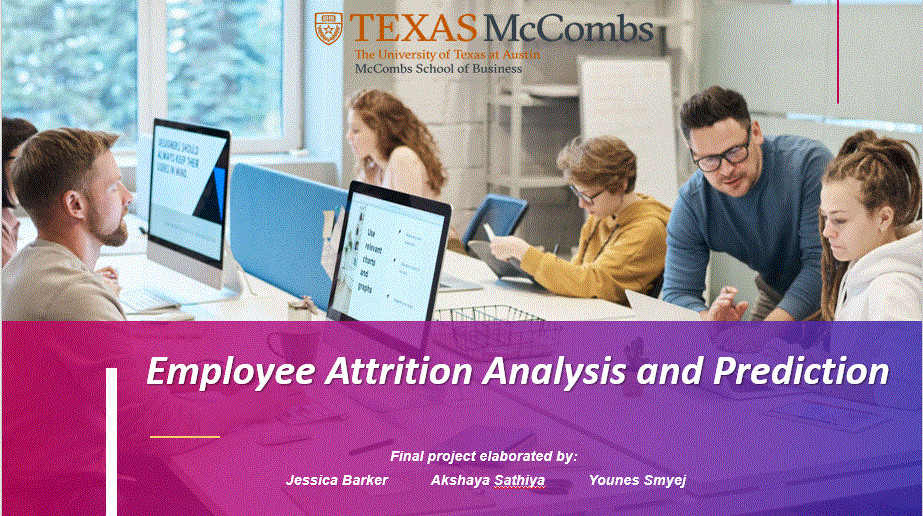

# Employee Attrition Analysis Project

## Overview

This project aims to provide a comprehensive analysis of employee attrition within a corporate setting. Employee attrition, the phenomenon of employees leaving an organization, can have far-reaching effects on productivity, morale, and overall organizational success. By leveraging a dataset encompassing various employee attributes and attrition status, this analysis seeks to uncover underlying patterns and insights that can inform organizational strategies for mitigating attrition.

## Introduction

Employee attrition is a critical concern for businesses, and understanding the factors driving attrition is essential for developing effective retention strategies. This project delves into the available employee attrition data to provide a nuanced view of the circumstances under which attrition tends to occur.

## Dataset

The primary dataset utilized in this analysis is "WA_Fn-UseC_-HR-Employee-Attrition.csv," which contains a rich array of attributes related to employees and their attrition status. This dataset enables us to explore variables such as age, gender, marital status, job satisfaction, distance from home, monthly income, job level, and more. The central "Attrition" column indicates whether an employee has left the company.

## Technologies Used

The analysis and visualization tasks are executed using the following technologies and libraries:

- Python
- numpy
- pandas
- matplotlib
- seaborn
- scikit-learn (for machine learning models)
- xgboost (for advanced boosting algorithms)

## Analysis Workflow

The project encompasses the following core stages:

1. **Data Loading**: Importing the dataset into a pandas DataFrame for further analysis.
2. **Data Cleaning**: Handling missing values and dropping irrelevant or redundant columns.
3. **Exploratory Data Analysis (EDA)**: Visualizing and investigating different attributes to uncover trends, correlations, and potential insights.
4. **Predictive Modeling**: Developing machine learning models to predict attrition based on employee attributes.
5. **Interpretation**: Interpreting model outputs and identifying key factors contributing to employee attrition.
6. **Conclusion and Recommendations**: Summarizing findings and providing actionable recommendations for organizations to address attrition concerns.

## Key Questions

Throughout the analysis, we aim to address key questions such as:

- What are the predominant factors associated with employee attrition?
- Are specific employee groups more susceptible to leaving the organization?
- Do particular attributes, like job satisfaction or distance from home, significantly impact attrition rates?

## Findings

The insights derived from this analysis hold the potential to guide organizational decision-making. By understanding the factors that contribute to attrition, businesses can implement targeted strategies to improve retention, bolster job satisfaction, and foster a conducive work environment.

## Contributors

This project was collaboratively developed by:

- Jessica Barker
- Akshaya Sathiya
- Younes Smyej

